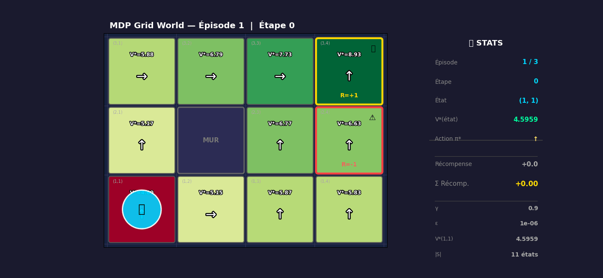

# Markov Decision Process — Value Iteration & Policy Iteration

> M1 Informatique — Parcours Intelligence Artificielle · Université d'Avignon · Mai 2025

[](https://python.org)
[](https://numpy.org)
[](https://jupyter.org)
[]()

---

## Overview

This project implements and compares two classical **Markov Decision Process (MDP)** planning algorithms — **Value Iteration** and **Policy Iteration** — on a stochastic grid-world navigation problem. An animated simulation visualizes the robot's behavior under the optimal policy.

---

## Table of Contents

- [Background](#background)
- [Project Structure](#project-structure)
- [Environment](#environment)
- [Algorithms](#algorithms)
  - [1. Value Iteration](#1-value-iteration)
  - [2. Policy Iteration](#2-policy-iteration)
- [Results](#results)
  - [Optimal Values & Policy](#optimal-values--policy)
  - [Effect of Discount Factor γ](#effect-of-discount-factor-γ)
  - [Algorithm Comparison](#algorithm-comparison)
- [Simulation](#simulation)
- [Key Results](#key-results)
- [Installation](#installation)
- [Usage](#usage)
- [Author](#author)

---

## Background

A **Markov Decision Process** is a tuple $(\mathcal{S}, \mathcal{A}, P, R, \gamma)$ where:
- $\mathcal{S}$ — finite set of states
- $\mathcal{A}$ — finite set of actions
- $P(s' \mid s, a)$ — stochastic transition probabilities
- $R(s)$ — immediate reward
- $\gamma \in [0,1)$ — discount factor

The goal is to find an **optimal policy** $\pi^* : \mathcal{S} \to \mathcal{A}$ that maximizes the expected discounted cumulative reward:
$$V^*(s) = \max_\pi \mathbb{E}_\pi\left[\sum_{t=0}^{\infty} \gamma^t R(s_t) \;\middle|\; s_0 = s\right]$$

---

## Project Structure

```
markov-decision-process-planning/
├── mdp.ipynb               # Main Jupyter notebook (full implementation)
├── gen_gif.py              # Animation generation script
├── gif_frames/             # Individual frames (frame000.png … frame022.png)
├── mdp_simulation.gif      # Animated robot trajectory
├── mdp_simulation.html     # Interactive HTML animation
├── grille_initiale.png     # Initial grid visualization
├── VI_resultats.png        # Value Iteration results heatmap
├── VI_gamma.png            # Effect of γ on convergence
├── convergence_VI.png      # Convergence curve of δ_k
├── comparaison_VI_PI.png   # VI vs PI comparison chart
├── rapport_TP4_MDP.pdf     # Full technical report
├── rapport_TP4_MDP.tex     # LaTeX source
├── TP.pdf                  # Original subject
└── README.md
```

---

## Environment

A **3×4 grid** with stochastic transitions and two terminal states:

```
┌─────────┬─────────┬─────────┬─────────────┐
│  (3,1)  │  (3,2)  │  (3,3)  │ (3,4) R=+1  │
├─────────┼─────────┼─────────┼─────────────┤
│  (2,1)  │   WALL  │  (2,3)  │ (2,4) R=−1  │
├─────────┼─────────┼─────────┼─────────────┤
│ (1,1) ★ │  (1,2)  │  (1,3)  │   (1,4)     │
└─────────┴─────────┴─────────┴─────────────┘
```

| Parameter | Value |
|-----------|-------|
| States | 11 valid (wall at (2,2)) |
| Actions | N, S, E, O |
| Rewards | R(3,4) = +1, R(2,4) = −1, others = 0 |
| Start state | (1,1) ★ |
| Discount γ | 0.9 |
| Convergence ε | 10⁻⁶ |

**Stochastic transitions:** When the agent requests direction $d$, it moves:
- 80% in direction $d$
- 10% perpendicular left
- 10% perpendicular right

---

## Algorithms

### 1. Value Iteration

Repeatedly applies the **Bellman optimality operator**:

$$V_{k+1}(s) = R(s) + \gamma \cdot \max_{a \in \mathcal{A}} \sum_{s'} P(s' \mid s, a)\, V_k(s')$$

Stops when $\delta_k = \max_s |V_{k+1}(s) - V_k(s)| < \varepsilon$.

```python
V = np.zeros(N_STATES)
for iteration in range(10000):
    Q = (P * V[:, None, None]).sum(axis=0)   # shape: (N_STATES, N_ACTIONS)
    V_new = R + gamma * Q.max(axis=1)
    delta = np.max(np.abs(V_new - V))
    V = V_new.copy()
    if delta < epsilon:
        break
```

### 2. Policy Iteration

Alternates between **exact policy evaluation** (linear system solve) and **greedy policy improvement**:

$$\underbrace{(I - \gamma P^\pi)\, \mathbf{v}^\pi = \mathbf{r}}_{\text{evaluation via } \mathtt{numpy.linalg.solve}} \quad \Rightarrow \quad \pi_\text{new}(s) = \arg\max_a \sum_{s'} P(s' \mid s, a)\, V^\pi(s')$$

---

## Results

### Optimal Values & Policy

| State | V*(s) | Action π*(s) | Interpretation |
|-------|--------|---------------|----------------|
| (1,1) ★ | **+4.596** | N | Move up toward row 2 |
| (1,2) | +5.150 | E | Head right |
| (1,3) | +5.865 | N | Move up |
| (1,4) | +5.828 | N | Flee from (2,4) |
| (2,1) | +5.165 | N | Move up toward row 3 |
| (2,3) | +6.774 | N | Move toward (3,3) |
| (2,4) | +6.633 | N | Reach +1, avoid −1 |
| (3,1) | +5.882 | E | Head right |
| (3,2) | +6.789 | E | Head right |
| (3,3) | +7.732 | E | Almost at goal |
| (3,4) | **+8.926** | — | Terminal (R=+1) |

The policy routes the robot to (3,4) while systematically avoiding (2,4).

### Effect of Discount Factor γ

| γ | Iterations | V*(1,1) |
|---|------------|---------|
| 0.10 | 7 | +0.000 |
| 0.50 | 21 | +0.032 |
| **0.90** | **131** | **+4.596** |
| 0.99 | 1,363 | +82.359 |

Low γ → myopic agent (ignores future). High γ → forward-looking but slower convergence.

### Algorithm Comparison

| Criterion | Value Iteration | Policy Iteration |
|-----------|-----------------|------------------|
| Iterations | **131** | **3** |
| Wall time | 11 ms | 2 ms |
| Optimal policy | ✅ Identical $\pi^*$ | ✅ Identical $\pi^*$ |
| Values ($\Delta$) | — | $< 10^{-4}$ |
| Cost/iteration | $O(\|\mathcal{S}\|^2 \|\mathcal{A}\|)$ | $O(\|\mathcal{S}\|^3) + O(\|\mathcal{S}\|^2 \|\mathcal{A}\|)$ |
| Convergence type | Asymptotic (ε-criterion) | Exact (finite steps) |

**Policy Iteration converges 44× faster** in iterations, but each step solves a linear system. For small state spaces ($\|\mathcal{S}\| = 11$), both are near-instantaneous.

---

## Simulation

The robot follows $\pi^*$ under stochastic transitions (80/10/10):



Each cell shows $V^*(s)$ and the direction arrow $\pi^*(s)$. Color scale: red (low value) → green (high value). The robot reliably reaches (3,4) from (1,1).

---

## Key Results

| Metric | Value Iteration | Policy Iteration |
|--------|-----------------|------------------|
| Iterations to converge | **131** | **3** |
| Execution time | 11 ms | 2 ms |
| V*(start = (1,1)) | +4.596 | +4.596 |
| V*(goal = (3,4)) | +8.926 | +8.926 |
| Same optimal policy | ✅ Yes | ✅ Yes |

---

## Installation

```bash
git clone https://github.com/KELI-Kekeli-Christ/markov-decision-process-planning.git
cd markov-decision-process-planning
pip install numpy matplotlib jupyter pillow
jupyter notebook mdp.ipynb
```

---

## Usage

```python
# Run Value Iteration
V_star, policy_VI, n_iter_VI = value_iteration(P, R, gamma=0.9, epsilon=1e-6)

# Run Policy Iteration
V_star, policy_PI, n_iter_PI = policy_iteration(P, R, gamma=0.9)

# Generate simulation GIF
python gen_gif.py
```

---

## Author

**Christ Kekeli KELI**  
M1 Informatique — Intelligence Artificielle  
Université d'Avignon · Mai 2025  
Encadrant : Yezekael HAYEL
